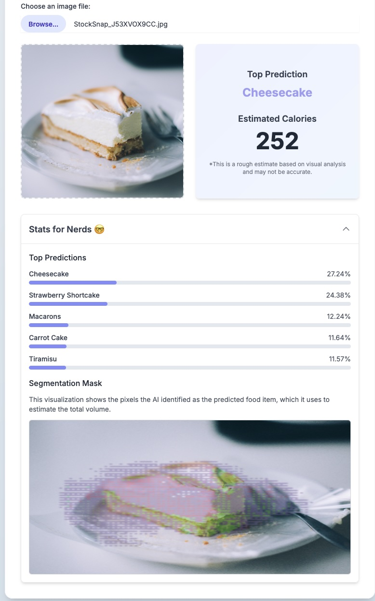

# Calorie counter in browser
Web-based application that uses deep learning models directly in the browser to identify food from an image (classifier), estimate its volume (segmentation), and provide a rough calorie count. This project demonstrates the power of running AI tasks entirely on the client side using TensorFlow.js.

# URL [`Webapp`](https://jonathancoletti.github.io/CalorieInBrowser)

# IMPORTANT INFO
Still in early stages (needs training on larger epochs, better calorie count, better food db, better/newer arch) but functional.


# Stack
- Frontend = HTML, CSS, JavaScript, Tailwind
- Machine Learning Frameworks = TensorFlow, Keras, Tensorflow.js
- Notebooks used to train and convert the model

# Dataset
- Food101 - Classification - [`Food101`](https://www.tensorflow.org/datasets/catalog/food101)
- Food103 - Segmentation - [`EduardoPacheco/FoodSeg103`](https://huggingface.co/datasets/EduardoPacheco/FoodSeg103)


# Images



# Vast AI

Vast AI was used to train the models. The command is

```
vastai create instance <OFFER_ID> --image vastai/tensorflow:2.16.1-cuda-12.4.1 --env '-p 1111:1111 -p 6006:6006 -p 8080:8080 -p 8384:8384 -p 72299:72299 -e OPEN_BUTTON_PORT=1111 -e OPEN_BUTTON_TOKEN=1 -e JUPYTER_DIR=/ -e DATA_DIRECTORY=/workspace/ -e PORTAL_CONFIG="localhost:1111:11111:/:Instance Portal|localhost:8080:18080:/:Jupyter|localhost:8080:8080:/terminals/1:Jupyter Terminal|localhost:8384:18384:/:Syncthing|localhost:6006:16006:/:Tensorboard"' --onstart-cmd 'entrypoint.sh' --disk 200 --jupyter --ssh --direct
```

# Challenges

## Dataset

# TODO
- Train higher epochs
- Optimizing food db
